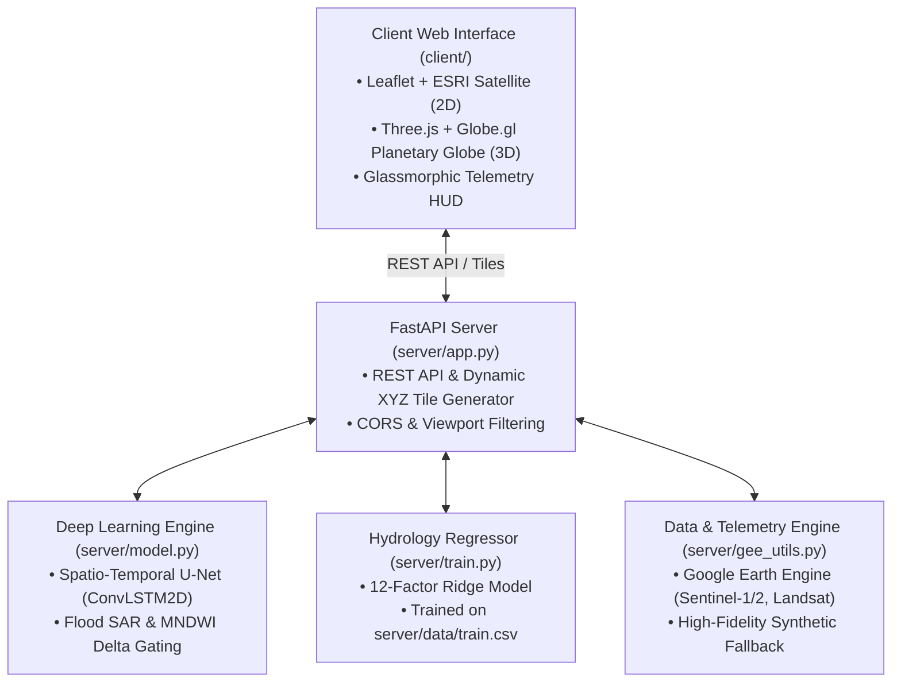

# EcoPulse 🌍

> **Planetary Climate Analytics & Multi-Hazard Earth Observation Platform**  
> Real-time monitoring of wildfire burn scars, flash flood inundation, agricultural drought risk, carbon flux anomalies, and planetary vegetation dynamics powered by multi-sensor satellite telemetry and spatio-temporal deep learning.

---

&nbsp;
&nbsp;
&nbsp;
&nbsp;
&nbsp;
&nbsp;
&nbsp;
[](LICENSE)

---

## 🌟 Overview

**EcoPulse** is an Earth Observation (EO) and climate risk intelligence system designed to process multi-spectral optical and synthetic aperture radar (SAR) satellite data in real time. It unifies bi-temporal computer vision models, planetary hydrology regressors, and an interactive GIS interface into a high-performance command center.

The platform provides dual operational modes:
1. **🌊 Flash Flood & Inundation Engine (Primary)**: Multi-modal Sentinel-1 SAR backscatter drop detection, MNDWI water expansion analysis, and multivariate flood susceptibility modeling (FFSI) trained directly on empirical basin telemetry (`server/data/train.csv`).
2. **🔥 Wildfire & Biomass Loss Engine (Secondary)**: Bi-temporal burn scar segmentation, active thermal hotspot tracking, canopy loss quantification, and $CO_2$ emission estimation using a Spatio-Temporal U-Net with ConvLSTM2D bottlenecks.

---

## 🚀 Key Features

- **Dual Visualization Engines**:
  - **Open Satellite Engine (2D)**: Zero-API-key open GIS renderer pairing ESRI World Imagery with CartoDB Dark Matter base maps.
  - **Planetary WebGL Globe (3D)**: Token-free hardware-accelerated 3D planetary globe powered by Globe.gl and Three.js with pulsing hazard ripple rings, 3D telemetry markers, and clickable smooth camera transitions.
- **Deep Learning Inundation & Burn Segmentation**:
  - Pre-calibrated regional disaster scenes: **Nepal & Tibet** (mountain cloudburst surge), **India** (Indo-Gangetic & Brahmaputra basin), **Valencia** (DANA flash flood), **Bangladesh** (delta river swell), **California** (Camp Fire corridor), **Amazon** (rainforest deforestation), and **Borneo** (peatland fires).
  - **Live Viewport Scanning**: Runs AI segmentation across any bounding box centered on the user's active viewport with water-body masking to eliminate false positives in oceans and seas.
- **Dynamic Multi-Tier AI Hazard Severity**:
  - Evaluates hazard severity dynamically into `CRITICAL`, `HIGH`, `MEDIUM` / `MODERATE`, `LOW`, and `NONE` (open water / zero risk) with color-coded UI indicators and GeoJSON telemetry popups.
- **Interactive Multi-Spectral & Radar Overlays**:
  - Live XYZ raster tile streaming for NDVI (Vegetation Index), Carbon Flux Anomalies, Agricultural Drought (VCI), Burn Severity, Flash Flood Susceptibility (FFSI), and Inundation Extent.
- **Hydrological Basin Machine Learning**:
  - Multivariate ridge regressor trained on 12 critical watershed variables (Monsoon Intensity, Topography Drainage, River Management, Deforestation, Urbanization, Climate Change, Siltation, etc.).
- **Mobile & Desktop Optimized Glassmorphic UI**:
  - Responsive HUD with floating control drawers, collapsible telemetry panels, zoom lock, dynamic legends, and touch-friendly mobile landscape support.
- **Zero-Config Fallback & Live Earth Engine Integration**:
  - Out-of-the-box synthetic telemetry curves and procedural multi-spectral approximations when offline, seamlessly elevating to live Google Earth Engine (`COPERNICUS/S2_SR_HARMONIZED`, `COPERNICUS/S1_GRD`, `LANDSAT/LC08/C02/T1_L2`) with your Service Account or Google Cloud Project.

---

## 🏛️ Architecture



## ⚡ Quick Start

### 1. Windows One-Click Launcher
Launch both the FastAPI backend and web client with automated instant dependency verification:

```cmd
start.bat
```

This starts:
- **Client Web UI**: [http://localhost:8080](http://localhost:8080)
- **FastAPI Server**: [http://localhost:8000](http://localhost:8000)
- **Interactive Swagger Docs**: [http://localhost:8000/docs](http://localhost:8000/docs)

---

### 2. Manual Local Setup

#### Start the Server
```bash
# Install Python dependencies
pip install -r server/requirements.txt

# Start FastAPI development server
uvicorn server.app:app --reload --port 8000
```

#### Start the Client
```bash
# Serve client static assets on port 8080
python -m http.server 8080 --directory client
```

Navigate to `http://localhost:8080` in any modern web browser.

---

### 3. Docker Compose Stack

Run the complete multi-container production stack with Nginx reverse proxy:

```bash
docker compose up --build -d
```

- **Web Dashboard**: `http://localhost:8080`
- **Backend API**: `http://localhost:8000`

To shut down:
```bash
docker compose down
```

---

## 📡 REST API Reference

| Method | Endpoint | Description |
| :--- | :--- | :--- |
| `GET` | `/health` | Service health status and readiness probe |
| `GET` | `/api/config` | Inspect telemetry provider configuration and credentials |
| `GET` | `/api/metrics` | Headline metrics (global or filtered by viewport `bbox`) |
| `GET` | `/api/ndvi` | Time-series NDVI, NDWI, and carbon flux spectral curves |
| `GET` | `/api/drought` | Agricultural drought vulnerability (VCI, soil moisture, rainfall deficit) |
| `GET` | `/api/flood/risk` | Flash flood susceptibility (FFSI, soil saturation, runoff curve) |
| `GET` | `/api/alerts` | Real-time global flood, deforestation, and wildfire alert stream |
| `POST` | `/api/inference/wildfire` | Bi-temporal Spatio-Temporal U-Net burn scar segmentation |
| `POST` | `/api/inference/flood` | Multi-modal SAR & MNDWI flood inundation segmentation |
| `GET` | `/api/tiles/{layer}/{z}/{x}/{y}.png` | Dynamic XYZ tiles (`ndvi`, `carbon`, `drought`, `burn`, `flood_risk`, `inundation`) |
| `GET` | `/api/export` | Download structured multi-hazard planetary telemetry reports |

---

## 🧠 Machine Learning & Hydrology

### Spatio-Temporal U-Net Architecture
- **Input Tensor**: `(Batch, Time=2, Height=256, Width=256, Channels=3)` (Pre- and post-disturbance multi-spectral frames)
- **TimeDistributed Encoder**: 3-level feature pyramid extracting multi-scale spectral features
- **ConvLSTM2D Temporal Bottleneck**: Captures dynamic temporal transitions and spectral differencing across observation dates
- **Decoder with Skip Connections**: Reconstructs fine-grained spatial damage masks at 10m ground resolution

### Multivariate Hydrological Model
Trained on `server/data/train.csv` to compute basin vulnerability from 12 empirical variables:
$$\text{FFSI} = \mathbf{w}^T \mathbf{x} + b$$
Features include **Monsoon Intensity**, **Topography Drainage**, **River Management**, **Deforestation Index**, **Urbanization**, and **Drainage Infrastructure**.

To retrain the model weights:
```bash
python -m server.train
```

---

## 🧪 Automated Testing

Run the automated pytest test suite covering all endpoints, model inferences, tile generation, and ocean exclusion filters:

```bash
python -m pytest server/tests -v
```

```text
======================= 37 passed in 3.88s =======================
```

---

## ☁️ Cloud Deployment

### GitHub Pages (Static Client)
The client web application is automatically built and deployed to GitHub Pages via [.github/workflows/deploy-gh-pages.yml](.github/workflows/deploy-gh-pages.yml) upon pushes to `main`.
- When deployed statically, the client runs in standalone demo mode with client-side telemetry approximations.

### Render / Cloud Hosting (API Server)
A production-ready [render.yaml](render.yaml) is included for one-click deployment on Render:
- **Build Command**: `pip install -r server/requirements.txt`
- **Start Command**: `uvicorn server.app:app --host 0.0.0.0 --port $PORT`

---

## 📄 License

This project is open-source software licensed under the [MIT License](LICENSE).
