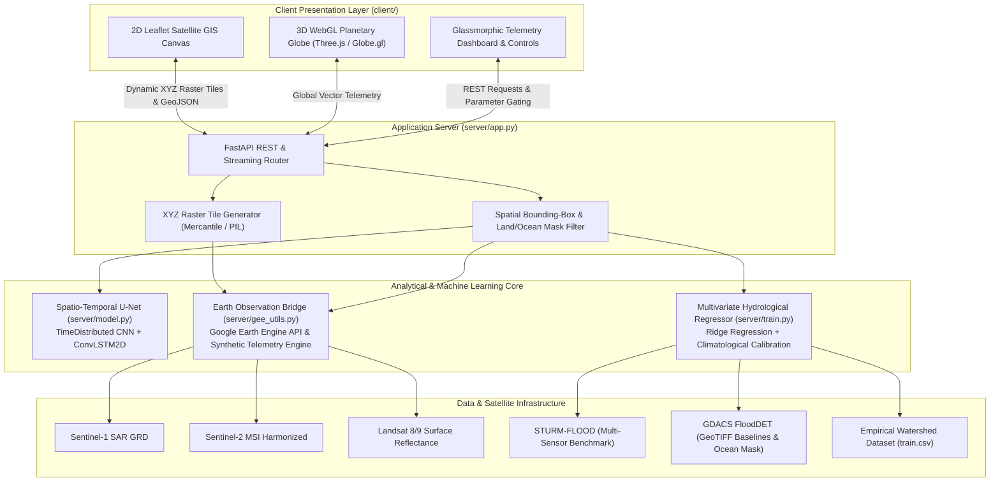
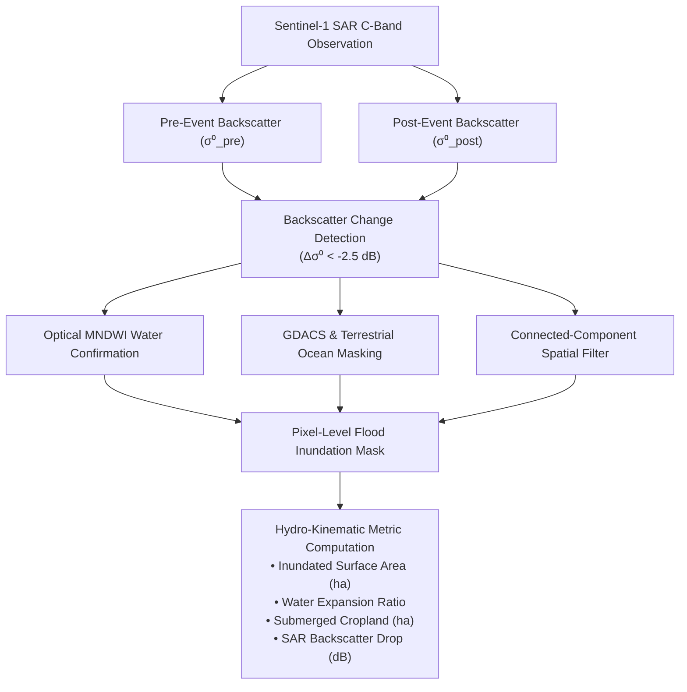
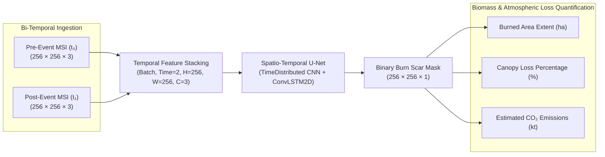
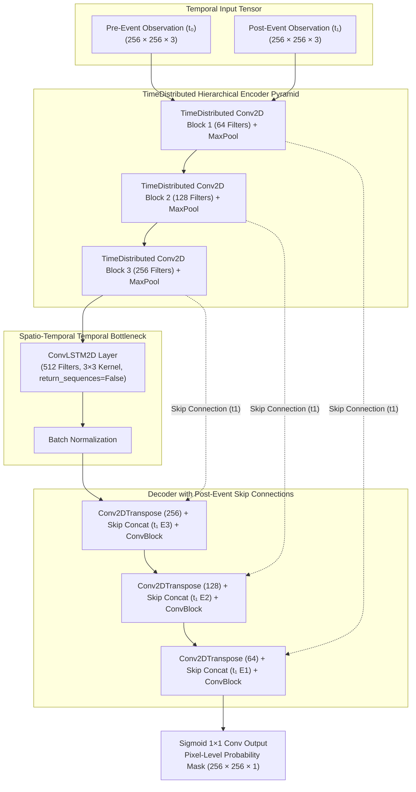
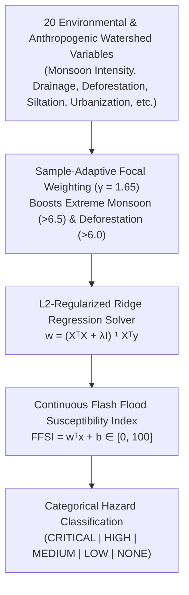
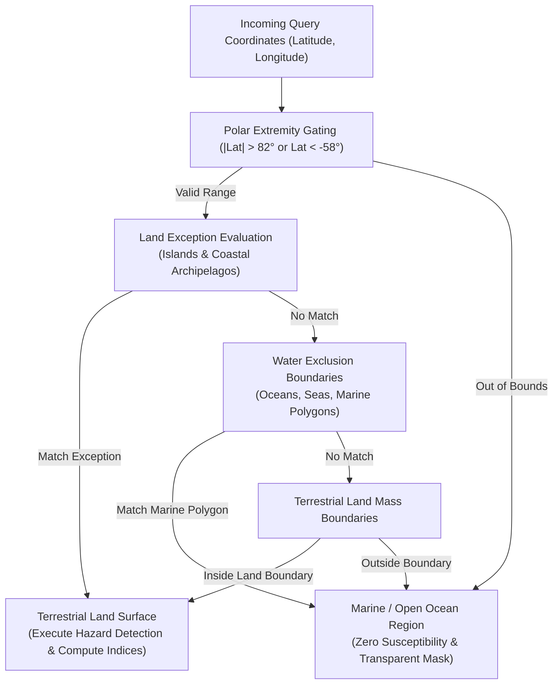
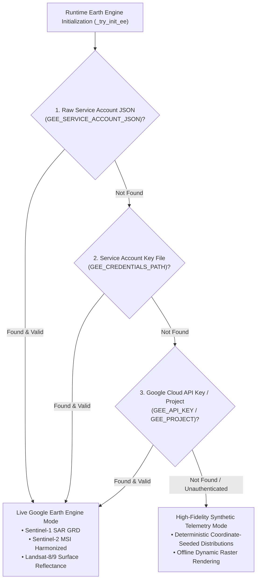
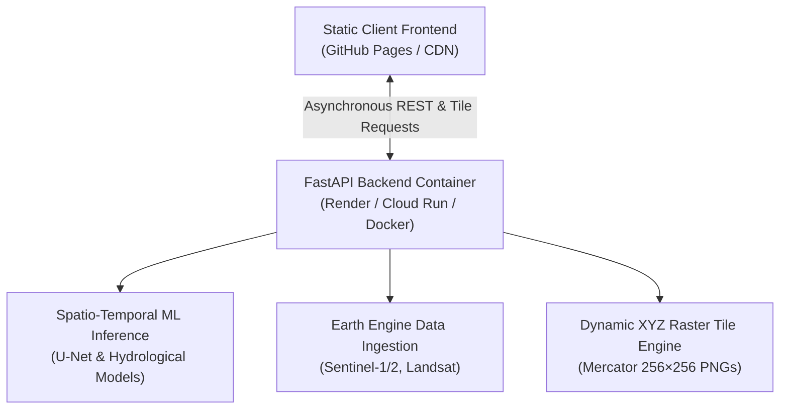

# EcoPulse

> Planetary Climate Analytics and Multi-Hazard Earth Observation Platform

[](https://www.python.org/)
[](https://fastapi.tiangolo.com/)
[](https://www.tensorflow.org/)
[](https://leafletjs.com/)
[](https://threejs.org/)
[](https://globe.gl/)
[](https://www.docker.com/)
[](LICENSE)

---

## Abstract

EcoPulse is a planetary-scale Earth Observation (EO) analytics platform for monitoring and analyzing environmental hazards and ecosystem dynamics using multispectral optical imagery, synthetic aperture radar (SAR), deep learning, and geospatial stream processing. The system provides an integrated analytical environment for detecting flash flood inundation, wildfire burn scars, agricultural drought stress, vegetation degradation, and carbon flux anomalies.

The architecture couples satellite-derived spectral indices with a dual-branch spatio-temporal deep learning network (incorporating `TimeDistributed` convolutional encoders and `ConvLSTM2D` bottlenecks) and a multivariate hydrological regression engine. Analytical outputs are exposed via high-throughput REST endpoints, dynamically projected XYZ raster tile services, GeoJSON telemetry streams, and synchronized 2D GIS and 3D WebGL globe interfaces.

---

## Table of Contents

- [Abstract](#abstract)
- [System Objectives](#system-objectives)
- [Core Capabilities](#core-capabilities)
- [System Architecture](#system-architecture)
- [Data Sources](#data-sources)
- [Hazard Analysis](#hazard-analysis)
  - [Flash Flood and Inundation](#flash-flood-and-inundation)
  - [Wildfire and Burn Scar Analysis](#wildfire-and-burn-scar-analysis)
  - [Agricultural Drought](#agricultural-drought)
  - [Vegetation Dynamics](#vegetation-dynamics)
  - [Carbon Flux Anomalies](#carbon-flux-anomalies)
- [Machine Learning](#machine-learning)
  - [Spatio-Temporal U-Net](#spatio-temporal-u-net)
  - [Hydrological Risk Model](#hydrological-risk-model)
- [Geospatial Processing](#geospatial-processing)
  - [Raster Processing](#raster-processing)
  - [Spatial Filtering and Ocean Masking](#spatial-filtering-and-ocean-masking)
  - [Tile Generation](#tile-generation)
- [Visualization Interface](#visualization-interface)
  - [2D GIS Interface](#2d-gis-interface)
  - [3D Planetary Globe](#3d-planetary-globe)
  - [Telemetry and Alert Interface](#telemetry-and-alert-interface)
- [Hazard Classification](#hazard-classification)
- [REST API Reference](#rest-api-reference)
- [Project Structure](#project-structure)
- [Installation](#installation)
  - [Prerequisites](#prerequisites)
  - [Local Development](#local-development)
  - [Windows Launcher](#windows-launcher)
  - [Docker Container Stack](#docker-container-stack)
- [Configuration](#configuration)
  - [Environment Variables](#environment-variables)
  - [Google Earth Engine Authentication](#google-earth-engine-authentication)
  - [Offline and Synthetic Telemetry Mode](#offline-and-synthetic-telemetry-mode)
- [Model Training and Retraining](#model-training-and-retraining)
- [Testing and Validation](#testing-and-validation)
- [Deployment](#deployment)
  - [GitHub Pages](#github-pages)
  - [Cloud API Deployment](#cloud-api-deployment)
- [Performance Considerations](#performance-considerations)
- [Limitations](#limitations)
- [Future Development](#future-development)
- [License](#license)

---

## System Objectives

EcoPulse is designed to fulfill the following operational objectives:

- **Multi-Hazard Environmental Monitoring**: Continuous multi-modal surveillance across distinct hazard domains (floods, fires, drought, canopy loss).
- **Satellite-Derived Spatial Analysis**: Direct extraction of biophysical variables from calibrated optical surface reflectance and radar backscatter.
- **Near-Real-Time Hazard Assessment**: Rapid detection and classification of anomalous surface transitions across dynamic regions of interest.
- **Bi-Temporal Change Detection**: Robust differencing of pre- and post-disturbance observation scenes to delineate damage boundaries and calculate spatial extent.
- **Interactive Geospatial Visualization**: Dual-mode interactive mapping (2D orthographic GIS and 3D WebGL globe) supporting dynamic raster tile overlays and vector telemetry.
- **Offline-Capable Analytical Workflows**: Fault-tolerant architecture supporting live Google Earth Engine data ingestion with deterministic synthetic telemetry fallbacks during disconnected execution.

| Objective | Implementation |
| :--- | :--- |
| **Flood Detection** | Sentinel-1 SAR backscatter attenuation ($\Delta \sigma^0$) combined with Sentinel-2 MNDWI thresholding |
| **Wildfire Assessment** | Bi-temporal multispectral differencing (NBR/NDVI) processed via Spatio-Temporal U-Net |
| **Drought Monitoring** | Vegetation Condition Index (VCI), soil moisture proxy calculation, and rainfall anomaly estimation |
| **Vegetation Monitoring** | NDVI time-series smoothing, baseline departure tracking, and rolling Z-score anomaly gating |
| **Carbon Flux Analysis** | Spectral canopy health and degradation anomaly modeling expressed in proxy metric tons $\text{CO}_2/\text{ha}$ |
| **Hydrological Risk** | Multivariate Ridge regression over watershed morphology, precipitation, and anthropogenic pressure metrics |

---

## Core Capabilities

### Earth Observation Processing
- **Sentinel-1 SAR**: C-band Synthetic Aperture Radar GRD ingestion for all-weather, day-and-night surface water and structural change detection.
- **Sentinel-2 Multispectral**: 10-meter and 20-meter resolution MSI imagery ingestion across visible, RedEdge, NIR, and SWIR spectra.
- **Landsat 8/9**: Surface reflectance and Thermal Infrared (TIRS) cross-validation.
- **Bi-Temporal Scene Analysis**: Automated alignment and multi-temporal stacking of pre-event baseline and post-event observation rasters.
- **Spectral Index Engine**: Real-time evaluation of Normalized Difference Vegetation Index (NDVI), Modified Normalized Difference Water Index (MNDWI), Normalized Burn Ratio (NBR), and Vegetation Condition Index (VCI).

### Hazard Detection
- **Flood Inundation Delineation**: Surface water expansion mapping with radar backscatter drop gating ($\Delta \text{dB}$).
- **Flash Flood Susceptibility (FFSI)**: Watershed-level hydrological risk scoring based on drainage, soil saturation, and precipitation anomalies.
- **Wildfire Burn-Scar Segmentation**: Pixel-level burn classification with canopy loss quantification and estimated atmospheric $\text{CO}_2$ release.
- **Vegetation Stress Tracking**: Detection of abrupt vegetation decline against rolling historical baselines.
- **Agricultural Drought Vulnerability**: Multi-factor soil-canopy moisture stress categorization.

### Geospatial Analytics
- **Viewport-Bounded Analysis**: Dynamic bounding-box calculation that limits spatial processing strictly to the user's active map view.
- **Dynamic XYZ Raster Generation**: On-the-fly rendering of 256x256 Web Mercator PNG tiles with color-mapped hazard intensities.
- **Spatial Masking**: Global terrestrial/ocean vector exclusion filters to eliminate ocean false-positives in coastal views.
- **Structured Telemetry Ingestion**: Automated transformation of spatial raster inferences into GeoJSON telemetry features.

### Visualization
- **2D Orthographic GIS Engine**: High-performance Leaflet canvas utilizing ESRI World Imagery and cartographic reference layers.
- **3D Planetary Globe**: Hardware-accelerated Three.js/Globe.gl sphere with dynamic altitude pins, animated hazard ripple rings, and smooth camera tweening.
- **Live Telemetry HUD**: Glassmorphic dashboard featuring time-series charts, layer opacity controllers, regional preset switchers, and GeoJSON popups.

---

## System Architecture


```mermaid
graph TD
    subgraph Client ["Client Presentation Layer (client/)"]
        UI2D["2D Leaflet Satellite GIS Canvas"]
        UI3D["3D WebGL Planetary Globe (Three.js / Globe.gl)"]
        HUD["Glassmorphic Telemetry Dashboard & Controls"]
    end

    subgraph API ["Application Server (server/app.py)"]
        Router["FastAPI REST & Streaming Router"]
        TileEngine["XYZ Raster Tile Generator (Mercantile / PIL)"]
        ViewportFilter["Spatial Bounding-Box & Land/Ocean Mask Filter"]
    end

    subgraph Analytics ["Analytical & Machine Learning Core"]
        UNet["Spatio-Temporal U-Net (server/model.py)<br/>TimeDistributed CNN + ConvLSTM2D"]
        Hydro["Multivariate Hydrological Regressor (server/train.py)<br/>Ridge Regression + Climatological Calibration"]
        GEE["Earth Observation Bridge (server/gee_utils.py)<br/>Google Earth Engine API & Synthetic Telemetry Engine"]
    end

    subgraph Data ["Data & Satellite Infrastructure"]
        S1["Sentinel-1 SAR GRD"]
        S2["Sentinel-2 MSI Harmonized"]
        L8["Landsat 8/9 Surface Reflectance"]
        STURM["STURM-FLOOD (Multi-Sensor Benchmark)"]
        GDACS["GDACS FloodDET (GeoTIFF Baselines & Ocean Mask)"]
        CSV["Empirical Watershed Dataset (train.csv)"]
    end

    UI2D <-->|Dynamic XYZ Raster Tiles & GeoJSON| Router
    UI3D <-->|Global Vector Telemetry| Router
    HUD <-->|REST Requests & Parameter Gating| Router

    Router --> TileEngine
    Router --> ViewportFilter

    TileEngine --> GEE
    ViewportFilter --> UNet
    ViewportFilter --> Hydro
    ViewportFilter --> GEE

    GEE --> S1
    GEE --> S2
    GEE --> L8
    Hydro --> CSV
    Hydro --> STURM
    Hydro --> GDACS
```

### Data Flow Overview

The client interface communicates with the FastAPI application layer through asynchronous HTTP REST requests and standard Web Mercator XYZ tile URLs (`/api/tiles/{layer}/{z}/{x}/{y}.png`). When an analytical query or scene inference is triggered, the backend extracts the bounding coordinates, evaluates terrestrial land coverage via spatial masks, and orchestrates data retrieval through Google Earth Engine (or deterministic synthetic routines when disconnected). 

Image arrays are normalized, converted into structured tensors, and passed through the Spatio-Temporal U-Net or Hydrological Regression engine. The resulting binary masks, continuous risk indices, and spatial metrics are converted into GeoJSON vector geometries or dynamically rendered PNG rasters before transmission back to the client.

---

## Data Sources

| Dataset / Product | Sensor / Platform | Spatial Resolution | Primary Application |
| :--- | :--- | :--- | :--- |
| **COPERNICUS/S1_GRD** | Sentinel-1 C-Band SAR | 10 m | Flood inundation, surface water expansion, backscatter change |
| **COPERNICUS/S2_SR_HARMONIZED** | Sentinel-2 MSI | 10 m – 20 m | Multispectral vegetation indices, burn scar differencing, water extraction |
| **LANDSAT/LC08/C02/T1_L2** | Landsat 8 OLI/TIRS | 30 m | Long-term thermal and multispectral surface reflectance validation |
| **STURM-FLOOD** | Spatio-Temporal SAR / MSI Benchmark | 10 m / Multi-Resolution | Multi-sensor inundation benchmark calibration and cross-sensor flood validation |
| **GDACS FloodDET** | Global Disaster Alert & Coordination System | Gridded GeoTIFF / Global | Climatological baseline statistics (`AveragesAndSd`), calibration grids, and global ocean exclusion mask (`oceanmask.tif`) |
| **Empirical Hydrological Corpus** | Field & Gauge Records (`train.csv`) | Basin Level | Supervised training of multivariate flash flood susceptibility regression |

### Climatological & Benchmark Datasets
- **STURM-FLOOD Benchmark Suite**: Multi-modal spatio-temporal benchmark combining Sentinel-1 SAR backscatter and Sentinel-2 MSI optical channels to calibrate inundation probability under heavy cloud and varying land-cover conditions.
- **GDACS FloodDET Climatology & Masks**: Global Disaster Alert and Coordination System (GDACS) spatial layers utilized in `server/train.py` for climatological baseline mean/standard-deviation variance estimation (`AveragesAndSd`), dynamic focal edge boosting ($1.50\text{--}1.85\times$), and global terrestrial vs. marine surface masking (`oceanmask.tif`).

### Sensor Bands and Measurements
- **SAR Backscatter ($\sigma^0$)**: Dual-polarization VV and VH backscatter measurements used to penetrate cloud cover and distinguish calm open water (specular reflection) from rough terrain.
- **Near-Infrared (NIR - Band 8)**: High reflectance across healthy plant cellular structures; primary component for vegetation vigor estimation.
- **Red (Band 4)**: Chlorophyll absorption band used in contrasting vegetation health against bare ground.
- **Green (Band 3)**: Water reflectance reference used in optical water indexing.
- **Short-Wave Infrared (SWIR - Bands 11 & 12)**: Moisture absorption and soil silica reflectance; critical for NBR burn severity and MNDWI delineation.
- **Thermal Infrared (TIRS)**: Surface kinetic temperature anomalies for drought and evapotranspiration proxies.

### Derived Biophysical Products

$$
\begin{aligned}
\text{NDVI} &= \frac{\text{NIR} - \text{Red}}{\text{NIR} + \text{Red}} \\[8pt]
\text{MNDWI} &= \frac{\text{Green} - \text{SWIR}}{\text{Green} + \text{SWIR}} \\[8pt]
\text{NBR} &= \frac{\text{NIR} - \text{SWIR}}{\text{NIR} + \text{SWIR}} \\[8pt]
\text{VCI} &= \frac{\text{NDVI} - \text{NDVI}_{\min}}{\text{NDVI}_{\max} - \text{NDVI}_{\min}} \times 100 \\[8pt]
\Delta \sigma^0 &= \sigma^0_{\text{post}} - \sigma^0_{\text{pre}} \quad (\text{dB}) \\[8pt]
\text{FFSI} &= \mathbf{w}^T \mathbf{x} + b \quad [0, 100]
\end{aligned}
$$

- **NDVI (Normalized Difference Vegetation Index)**: Photosynthetic canopy vigor $[0.0, 1.0]$.
- **MNDWI (Modified Normalized Difference Water Index)**: Surface water expansion $[-1.0, 1.0]$.
- **NBR (Normalized Burn Ratio)**: Wildfire perimeter and burn severity delineation.
- **VCI (Vegetation Condition Index)**: Relative vegetative health normalized against multi-year historical extremes $[0, 100]$.
- **$\Delta \sigma^0$ (SAR Backscatter Delta)**: Sentinel-1 SAR backscatter attenuation isolating cloud-penetrating standing water.
- **FFSI (Flash Flood Susceptibility Index)**: Composite multi-factor hydrological watershed vulnerability score $[0, 100]$.

---

## Hazard Analysis

### Flash Flood and Inundation

Flash flood and standing water detection in EcoPulse combines active microwave sensing with optical spectral gating to produce flood masks and downstream hydrological metrics.


```mermaid
flowchart TD
    S1["Sentinel-1 SAR C-Band Observation"]
    Pre["Pre-Event Backscatter (σ⁰_pre)"]
    Post["Post-Event Backscatter (σ⁰_post)"]
    
    Diff["Backscatter Change Detection<br/>(Δσ⁰ &lt; -2.5 dB)"]
    
    MNDWI["Optical MNDWI Water Confirmation"]
    OceanMask["GDACS & Terrestrial Ocean Masking"]
    Filter["Connected-Component Spatial Filter"]
    
    Mask["Pixel-Level Flood Inundation Mask"]
    
    Metrics["Hydro-Kinematic Metric Computation<br/>• Inundated Surface Area (ha)<br/>• Water Expansion Ratio<br/>• Submerged Cropland (ha)<br/>• SAR Backscatter Drop (dB)"]
    
    S1 --> Pre
    S1 --> Post
    Pre & Post --> Diff
    Diff --> MNDWI & OceanMask & Filter
    MNDWI & OceanMask & Filter --> Mask
    Mask --> Metrics
```

> **Note on Detection vs. Susceptibility Modeling**: Observational flood delineation (SAR/MNDWI change detection) quantifies *currently standing surface water*, whereas the Hydrological Risk Model computes *antecedent and predictive watershed susceptibility (FFSI)* based on terrain drainage, soil saturation, and rainfall anomalies.

---

### Wildfire and Burn Scar Analysis

Wildfire analysis uses bi-temporal multispectral pairs acquired before and after fire progression.


```mermaid
flowchart LR
    subgraph Inputs ["Bi-Temporal Ingestion"]
        Pre["Pre-Event MSI (t₀)<br/>(256 × 256 × 3)"]
        Post["Post-Event MSI (t₁)<br/>(256 × 256 × 3)"]
    end

    Stack["Temporal Feature Stacking<br/>(Batch, Time=2, H=256, W=256, C=3)"]
    UNet["Spatio-Temporal U-Net<br/>(TimeDistributed CNN + ConvLSTM2D)"]
    BurnMask["Binary Burn Scar Mask<br/>(256 × 256 × 1)"]

    subgraph Metrics ["Biomass & Atmospheric Loss Quantification"]
        Area["Burned Area Extent (ha)"]
        Canopy["Canopy Loss Percentage (%)"]
        CO2["Estimated CO₂ Emissions (kt)"]
    end

    Pre & Post --> Stack
    Stack --> UNet
    UNet --> BurnMask
    BurnMask --> Area & Canopy & CO2
```

- **Input Tensor Dimensions**: `(Batch, Time=2, Height=256, Width=256, Channels=3)`
- **Loss Computation**: Continuous canopy loss is derived from the segmented burn area multiplied by regional biomass density factors ($B_d \approx 120\text{--}280\,\text{t/ha}$).
- **Atmospheric Emission Proxy**: Net $\text{CO}_2$ release ($E_{\text{CO}_2}$) is estimated using stoichiometric combustion assumptions:

$$
E_{\text{CO}_2} = A_{\text{burn}} \times B_d \times C_f \times 3.67
$$

where $A_{\text{burn}}$ is burned area, $B_d$ is biomass density ($120\text{--}280\,\text{t/ha}$), $C_f$ is combustion completeness ($\sim 0.45$), and $3.67$ is the $\text{C}\rightarrow\text{CO}_2$ stoichiometric molar conversion ratio.

---

### Agricultural Drought

Drought assessment evaluates multi-factor moisture deficits and vegetative stress:
- **Vegetation Condition Index (VCI)**: Normalizes current NDVI against historical multi-year extremes to isolate climatic stress from seasonal phenology.
- **Soil Moisture Proxy**: Modeled water potential expressed in $-\text{kPa}$ based on antecedent precipitation and temperature departures.
- **Precipitation Anomaly**: Multi-week departure from long-term climatological rainfall averages.

*Classification outputs denote modeled environmental vulnerability proxies rather than direct in-situ soil moisture sensor probe readings.*

---

### Vegetation Dynamics

EcoPulse computes temporal vegetative trends across arbitrary bounding boxes:
- **NDVI Time Series**: Interpolated rolling historical series tracking photosynthetic activity.
- **Rolling Z-Score Anomaly Gating**: Statistical outlier detection flagging canopy departures exceeding $2.0\,\sigma$ from trailing baselines.
- **Vegetation Loss Rate**: Quantitative rate-of-change estimation over specified temporal windows.

---

### Carbon Flux Anomalies

The platform computes a carbon flux status descriptor based on mean vegetative condition:
- $\text{NDVI} > 0.65$: **Carbon Sink** (Active net sequestration)
- $0.40 \le \text{NDVI} \le 0.65$: **Equilibrium** (Moderate sequestration / stable canopy)
- $\text{NDVI} < 0.40$: **Carbon Source** (Canopy degradation / high flux anomaly)

*Carbon flux indicators are modeled spectral proxies designed for regional comparative prioritization and should not be confused with eddy covariance tower gas measurements.*

---

## Machine Learning

### Spatio-Temporal U-Net

The core deep learning segmentation architecture is designed to capture temporal transitions directly across multi-date satellite scenes:


```mermaid
flowchart TD
    subgraph Inputs ["Temporal Input Tensor"]
        T0["Pre-Event Observation (t₀)<br/>(256 × 256 × 3)"]
        T1["Post-Event Observation (t₁)<br/>(256 × 256 × 3)"]
    end

    subgraph Encoder ["TimeDistributed Hierarchical Encoder Pyramid"]
        E1["TimeDistributed Conv2D Block 1 (64 Filters) + MaxPool"]
        E2["TimeDistributed Conv2D Block 2 (128 Filters) + MaxPool"]
        E3["TimeDistributed Conv2D Block 3 (256 Filters) + MaxPool"]
    end

    subgraph Bottleneck ["Spatio-Temporal Temporal Bottleneck"]
        LSTM["ConvLSTM2D Layer<br/>(512 Filters, 3×3 Kernel, return_sequences=False)"]
        BN["Batch Normalization"]
    end

    subgraph Decoder ["Decoder with Post-Event Skip Connections"]
        D3["Conv2DTranspose (256) + Skip Concat (t₁ E3) + ConvBlock"]
        D2["Conv2DTranspose (128) + Skip Concat (t₁ E2) + ConvBlock"]
        D1["Conv2DTranspose (64) + Skip Concat (t₁ E1) + ConvBlock"]
    end

    Output["Sigmoid 1×1 Conv Output<br/>Pixel-Level Probability Mask (256 × 256 × 1)"]

    T0 & T1 --> E1
    E1 --> E2
    E2 --> E3
    E3 --> LSTM
    LSTM --> BN
    BN --> D3
    D3 --> D2
    D2 --> D1
    D1 --> Output

    E3 -.->|"Skip Connection (t1)"| D3
    E2 -.->|"Skip Connection (t1)"| D2
    E1 -.->|"Skip Connection (t1)"| D1
```

| Component | Architecture Specification | Description |
| :--- | :--- | :--- |
| **Input Shape** | `(None, 2, 256, 256, 3)` | Bi-temporal image pair (pre- and post-disturbance) |
| **Encoder** | 3 $\times$ `TimeDistributed(Conv2D + BatchNorm + ReLU + MaxPool2D)` | Hierarchical feature extraction across both temporal slices simultaneously |
| **Temporal Module** | `ConvLSTM2D(512, kernel_size=3, padding='same')` | Spatio-temporal state transition capturing spectral differencing |
| **Skip Connections** | Direct connection from $t_1$ post-event encoder activations | Preserves high-frequency spatial boundaries during reconstruction |
| **Decoder** | 3 $\times$ `Conv2DTranspose + Concatenate + ConvBlock` | Upsamples latent representations back to original spatial dimensions |
| **Output Layer** | `Conv2D(1, kernel_size=1, activation='sigmoid')` | Pixel-wise disturbance probability map $[0.0, 1.0]$ |
| **Target Resolution** | $10\,\text{m}$ Ground Sampling Distance (GSD) | Calibrated for Sentinel-2 MSI and Sentinel-1 SAR spatial grids |

---

### Hydrological Risk Model

EcoPulse incorporates a multivariate Ridge regression model trained on basin observation records (`server/data/train.csv`) to predict watershed-level Flash Flood Susceptibility Index (FFSI) scores:


```mermaid
flowchart TD
    Vars["20 Environmental & Anthropogenic Watershed Variables<br/>(Monsoon Intensity, Drainage, Deforestation, Siltation, Urbanization, etc.)"]
    Focal["Sample-Adaptive Focal Weighting (γ = 1.65)<br/>Boosts Extreme Monsoon (&gt;6.5) & Deforestation (&gt;6.0)"]
    Ridge["L2-Regularized Ridge Regression Solver<br/>w = (XᵀX + λI)⁻¹ Xᵀy"]
    FFSI["Continuous Flash Flood Susceptibility Index<br/>FFSI = wᵀx + b ∈ [0, 100]"]
    Class["Categorical Hazard Classification<br/>(CRITICAL | HIGH | MEDIUM | LOW | NONE)"]

    Vars --> Focal
    Focal --> Ridge
    Ridge --> FFSI
    FFSI --> Class
```

#### Feature Vector $\mathbf{x} \in \mathbb{R}^{20}$
1. `MonsoonIntensity`
2. `TopographyDrainage`
3. `RiverManagement`
4. `Deforestation`
5. `Urbanization`
6. `ClimateChange`
7. `DamsQuality`
8. `Siltation`
9. `AgriculturalPractices`
10. `Encroachments`
11. `IneffectiveDisasterPreparedness`
12. `DrainageSystems`
13. `CoastalVulnerability`
14. `Landslides`
15. `Watersheds`
16. `DeterioratingInfrastructure`
17. `PopulationScore`
18. `WetlandLoss`
19. `InadequatePlanning`
20. `PoliticalFactors`

#### Mathematical Formulation

$$
\text{FFSI} = \mathbf{w}^T \mathbf{x} + b
$$

Subject to the $L_2$-regularized objective:

$$
\min_{\mathbf{w}, b} \sum_{i=1}^{N} \gamma_i \left( y_i - (\mathbf{w}^T \mathbf{x}_i + b) \right)^2 + \lambda \|\mathbf{w}\|_2^2
$$

where $\gamma_i$ represents sample-adaptive focal weights boosting extreme precipitation and high deforestation edge cases ($\gamma_i = 1.65$ when $\text{MonsoonIntensity} > 6.5$ or $\text{Deforestation} > 6.0$), and $\lambda = 5 \times 10^{-4}$.

---

## Geospatial Processing

### Raster Processing
- **Image Acquisition**: Bounding-box querying of Sentinel/Landsat collections via Earth Engine or offline procedural generators.
- **Band Extraction & Normalization**: Extraction of target reflectance bands scaled to $[0.0, 1.0]$.
- **Index Computation**: Element-wise array math yielding continuous biophysical index matrices.
- **Differencing & Masking**: Application of algorithmic thresholds to separate background terrain from active disturbance signals.

### Spatial Filtering and Ocean Masking
To prevent false-positive hazard classifications over marine environments, EcoPulse integrates a multi-tier bounding filter (`is_land_region` in `server/gee_utils.py`). Coordinates falling outside recognized land boundaries or inside major marine polygons (e.g., South Pacific, North Atlantic, Indian Ocean, Mediterranean, Bay of Bengal, Gulf of Mexico) are assigned zero susceptibility and rendered transparent.


```mermaid
flowchart TD
    Coords["Incoming Query Coordinates (Latitude, Longitude)"]
    Polar["Polar Extremity Gating (|Lat| > 82° or Lat < -58°)"]
    LandExceptions["Land Exception Evaluation<br/>(Islands & Coastal Archipelagos)"]
    WaterExclusions["Water Exclusion Boundaries<br/>(Oceans, Seas, Marine Polygons)"]
    LandBoxes["Terrestrial Land Mass Boundaries"]

    ResultLand["Terrestrial Land Surface<br/>(Execute Hazard Detection & Compute Indices)"]
    ResultWater["Marine / Open Ocean Region<br/>(Zero Susceptibility & Transparent Mask)"]

    Coords --> Polar
    Polar -->|Valid Range| LandExceptions
    Polar -->|Out of Bounds| ResultWater
    LandExceptions -->|Match Exception| ResultLand
    LandExceptions -->|No Match| WaterExclusions
    WaterExclusions -->|Match Marine Polygon| ResultWater
    WaterExclusions -->|No Match| LandBoxes
    LandBoxes -->|Inside Land Boundary| ResultLand
    LandBoxes -->|Outside Boundary| ResultWater
```

### Tile Generation

The backend provides dynamic Web Mercator (EPSG:3857) tile generation on top of Slippy Map XYZ specifications:

```
GET /api/tiles/{layer}/{z}/{x}/{y}.png
```

Supported layer types:
- `ndvi`: Continuous color map representing vegetation vigor.
- `carbon`: Amber-to-red thermal gradient denoting carbon flux emission hotspots.
- `drought`: Brown-to-yellow gradient indicating moisture stress and VCI deficit.
- `burn`: High-contrast red/crimson overlay delineating active burn scars.
- `flood_risk`: Orange-red gradient representing multi-factor FFSI susceptibility.
- `inundation`: Cyan-blue translucent overlay isolating standing surface water expansion.

---

## Visualization Interface

### 2D GIS Interface
- **Base Layer**: High-resolution ESRI World Imagery satellite tiles.
- **Reference Overlays**: ESRI World Boundaries and Places cartographic vector overlays.
- **Dynamic Overlays**: XYZ analytical raster overlays served from the FastAPI backend with real-time opacity controls.
- **Interactive Hazards**: Selectable GeoJSON hazard markers displaying detailed incident telemetry popups.

### 3D Planetary Globe
- **Rendering Engine**: Hardware-accelerated WebGL rendering via Globe.gl and Three.js.
- **Hazard Visualization**: 3D extruded pins, spherical coordinate mapping, and pulsating hazard ripple rings color-coded by severity.
- **Camera Controller**: Smooth spherical camera interpolation between global perspective and regional disaster scenes.

### Telemetry and Alert Interface
- **Headline Metrics Bar**: Displays monitored area (Mha), active anomaly counts, average tile stream latency, and sensor status.
- **Time-Series Telemetry**: Interactive multi-curve visualizers for NDVI, NDWI, soil saturation, and carbon flux trends.
- **Alert Stream**: Real-time regional alert feed categorizing disaster events with direct camera jump links.

---

## Hazard Classification

EcoPulse uses a normalized multi-tier severity classification scheme across all hazard modules:

| Classification | Score / Signal Range | Interpretation | Recommended Operational Action |
| :--- | :--- | :--- | :--- |
| **CRITICAL** | $\ge 80\%$ or $\Delta \sigma^0 < -8.0\,\text{dB}$ | Severe, high-confidence disaster event; major inundation or active crown fire | Immediate operational alert; activate emergency response and evacuation protocols |
| **HIGH** | $60\% - 79\%$ | Substantial hazard signal; extensive canopy loss or high flood susceptibility | Deploy high-priority UAV/field surveillance; prepare flood mitigation infrastructure |
| **MEDIUM** | $40\% - 59\%$ | Moderate environmental stress or river swell; localized vegetation decline | Increase satellite observation frequency; monitor rainfall and catchment thresholds |
| **LOW** | $1\% - 39\%$ | Minor baseline variation within standard seasonal variance | Standard routine environmental monitoring |
| **NONE** | $0\%$ / Masked | Zero detected hazard; open ocean, permanent water body, or non-vegetated terrain | No action required |

---

## REST API Reference

| Method | Endpoint | Description |
| :--- | :--- | :--- |
| `GET` | `/health` | Service readiness probe and uptime health check |
| `GET` | `/api/config` | Runtime inspection of GEE credentials, ML model status, and map configurations |
| `GET` | `/api/metrics` | Global or viewport-filtered headline environmental telemetry |
| `GET` | `/api/ndvi` | Time-series spectral curves (NDVI, NDWI, carbon flux, rainfall, soil saturation) |
| `GET` | `/api/drought` | Agricultural drought indicators (VCI, soil moisture proxy, temperature anomaly) |
| `GET` | `/api/flood/risk` | Flash flood susceptibility (FFSI score, soil saturation, runoff factor, threat levels) |
| `GET` | `/api/alerts` | Multi-hazard planetary alert stream (filterable by hazard mode and bounding box) |
| `POST` | `/api/inference/wildfire` | Spatio-temporal U-Net burn scar segmentation on preset or custom uploaded scenes |
| `POST` | `/api/inference/flood` | Multi-modal SAR and MNDWI flood inundation segmentation |
| `GET` | `/api/tiles/{layer}/{z}/{x}/{y}.png` | Dynamic 256x256 XYZ PNG raster tile service |
| `GET` | `/api/export` | Download structured multi-hazard telemetry JSON reports |

### Inference Endpoint Examples

#### `POST /api/inference/wildfire`

**Request (Preset Scenario):**
```http
POST /api/inference/wildfire?preset=california HTTP/1.1
Host: localhost:8000
Accept: application/json
```

**Response (`200 OK`):**
```json
{
  "title": "California Camp Fire Burn Corridor",
  "preset": "california",
  "spatial_resolution": "10m (Sentinel-2 MSI)",
  "inference_ms": 42.15,
  "burned_area_hectares": 3480.5,
  "burned_canopy_percentage": 28.4,
  "estimated_co2_kt": 154.2,
  "severity_level": "CRITICAL - CROWN FIRE DAMAGE",
  "severity_breakdown": {
    "unburned_pct": 71.6,
    "low_severity_pct": 10.2,
    "moderate_severity_pct": 9.8,
    "high_severity_pct": 8.4
  },
  "visuals": {
    "pre_fire": "data:image/png;base64,iVBORw0KGgo...",
    "post_fire": "data:image/png;base64,iVBORw0KGgo...",
    "burn_mask": "data:image/png;base64,iVBORw0KGgo...",
    "rgb_composite": "data:image/png;base64,iVBORw0KGgo..."
  },
  "note": "Spatio-temporal U-Net with ConvLSTM2D temporal bottleneck and skip connections.",
  "bbox": [-121.65, 39.70, -121.40, 39.90]
}
```

#### `POST /api/inference/flood`

**Request (Custom Bounding Box):**
```http
POST /api/inference/flood?preset=custom&lon_min=85.2&lat_min=27.5&lon_max=85.6&lat_max=27.8 HTTP/1.1
Host: localhost:8000
Accept: application/json
```

**Response (`200 OK`):**
```json
{
  "title": "Flood Inundation Analysis AOI [85.40°, 27.65°]",
  "preset": "custom",
  "spatial_resolution": "10m (Sentinel-2 MSI + Sentinel-1 SAR)",
  "inference_ms": 38.60,
  "inundated_area_hectares": 1820.4,
  "inundated_percentage": 19.8,
  "submerged_cropland_ha": 640.2,
  "water_expansion_ratio": 2.45,
  "sar_backscatter_drop_db": -6.8,
  "surge_velocity_ms": 1.42,
  "infrastructure_risk_score": 78,
  "severity_level": "HIGH - SEVERE FLASH FLOOD SURGE",
  "model_anomaly_metrics": {
    "sar_attenuation_mean_db": -5.4,
    "mndwi_water_shift_pct": 34.2
  },
  "severity_breakdown": {
    "dry_land_pct": 80.2,
    "standing_water_pct": 12.1,
    "high_velocity_surge_pct": 7.7
  },
  "visuals": {
    "pre_flood": "data:image/png;base64,iVBORw0KGgo...",
    "post_flood": "data:image/png;base64,iVBORw0KGgo...",
    "flood_mask": "data:image/png;base64,iVBORw0KGgo..."
  },
  "note": "Spatio-temporal Flood U-Net with SAR backscatter & MNDWI water index delta gating."
}
```

---

## Project Structure

```text
EcoPulse/
├── client/                                 # Web client application
│   ├── css/                                # Glassmorphic UI styles and responsive rules
│   ├── js/                                 # Leaflet, Globe.gl, Three.js, and API client scripts
│   ├── favicon.svg                         # Vector branding icon
│   ├── index.html                          # Single-page interface container
│   ├── Dockerfile                          # Client static Nginx container definition
│   └── nginx.conf                          # Nginx reverse proxy configuration
│
├── server/                                 # FastAPI backend service
│   ├── data/                               # Training corpora and spatial calibration data
│   │   └── train.csv                       # Empirical multi-parameter flood records
│   ├── tests/                              # Automated pytest suite
│   │   ├── test_api.py                     # Endpoint, parameter validation, and CORS tests
│   │   └── test_model.py                   # Deep learning and regression inference tests
│   ├── weights/                            # Serialized model coefficients and weights
│   │   ├── flood_risk_model.json           # Ridge regression parameters
│   │   └── unet_burn.h5                    # Optional pre-trained neural network weights
│   ├── app.py                              # FastAPI router, CORS middleware, and tile service
│   ├── gee_utils.py                        # Earth Engine bridge, tile renderer, and spatial masks
│   ├── model.py                            # Spatio-Temporal U-Net architecture and inference
│   ├── train.py                            # Hydrological Ridge regression training pipeline
│   └── requirements.txt                    # Python server dependencies
│
├── .github/
│   └── workflows/
│       └── deploy-gh-pages.yml             # Automated GitHub Pages static deployment
│
├── docker-compose.yml                      # Multi-container orchestration (server + client)
├── Dockerfile                              # Backend container definition
├── render.yaml                             # Cloud deployment template for Render
├── start.bat                               # Windows one-click launcher
├── .env.example                            # Template environment variables
└── README.md                               # System documentation
```

---

## Installation

### Prerequisites
- **Python**: Version 3.10 or higher
- **Node.js / HTTP Server**: Optional (for static client hosting)
- **Docker & Docker Compose**: Optional (for containerized execution)
- **WebGL-Compatible Web Browser**: Google Chrome, Mozilla Firefox, Microsoft Edge, or Safari with WebGL 2.0 enabled
- **Google Earth Engine Account**: Optional (required only for live GEE satellite queries)

---

### Local Development

#### 1. Clone Repository & Setup Virtual Environment
```bash
git clone https://github.com/xylium117/ecopulse.git
cd ecopulse

python -m venv venv
# On Windows:
venv\Scripts\activate
# On Linux/macOS:
source venv/bin/activate
```

#### 2. Install Backend Dependencies
```bash
pip install -r server/requirements.txt
```

#### 3. Launch Backend API Server
```bash
uvicorn server.app:app --reload --host 127.0.0.1 --port 8000
```
The API documentation will be available at `http://127.0.0.1:8000/docs`.

#### 4. Launch Client Web Server
In a separate terminal window:
```bash
python -m http.server 8080 --directory client
```
Open `http://localhost:8080` in your web browser.

---

### Windows Launcher

EcoPulse includes an automated Windows batch launcher that validates the Python runtime, installs missing dependencies, and starts both backend and client services:

```cmd
start.bat
```

---

### Docker Container Stack

Deploy the complete multi-container stack (FastAPI backend + Nginx client proxy) using Docker Compose:

```bash
docker compose up --build -d
```

- **Web Dashboard**: `http://localhost:8080`
- **Backend API**: `http://localhost:8000`

To tear down the containers:
```bash
docker compose down
```

---

## Configuration

### Environment Variables

Copy `.env.example` to `.env` in the root directory to configure runtime parameters:

```bash
cp .env.example .env
```

| Variable | Default Value | Description |
| :--- | :--- | :--- |
| `PORT` | `8000` | Port for the FastAPI server |
| `HOST` | `0.0.0.0` | Network binding interface |
| `CORS_ORIGINS` | `*` | Comma-separated allowed CORS origins |
| `GEE_PROJECT` | `tidy-elf-448805-k4` | Google Cloud project ID for Earth Engine |
| `GEE_SERVICE_ACCOUNT` | *Optional* | Google Cloud Service Account email |
| `GEE_CREDENTIALS_PATH` | `./secrets/gee_credentials.json` | Path to Service Account JSON key file |
| `GEE_API_KEY` | *Optional* | Earth Engine API key (alternative to Service Account) |
| `MODEL_WEIGHTS_PATH` | `./server/weights/unet_burn.h5` | Path to trained Spatio-Temporal U-Net weights |

---

### Google Earth Engine Authentication

EcoPulse checks for Earth Engine credentials in the following order:


```mermaid
flowchart TD
    Start["Runtime Earth Engine Initialization (_try_init_ee)"]
    CheckJSON{"1. Raw Service Account JSON<br/>(GEE_SERVICE_ACCOUNT_JSON)?"}
    CheckFile{"2. Service Account Key File<br/>(GEE_CREDENTIALS_PATH)?"}
    CheckAPI{"3. Google Cloud API Key / Project<br/>(GEE_API_KEY / GEE_PROJECT)?"}
    
    LiveMode["Live Google Earth Engine Mode<br/>• Sentinel-1 SAR GRD<br/>• Sentinel-2 MSI Harmonized<br/>• Landsat-8/9 Surface Reflectance"]
    SyntheticMode["High-Fidelity Synthetic Telemetry Mode<br/>• Deterministic Coordinate-Seeded Distributions<br/>• Offline Dynamic Raster Rendering"]

    Start --> CheckJSON
    CheckJSON -->|Found & Valid| LiveMode
    CheckJSON -->|Not Found| CheckFile
    CheckFile -->|Found & Valid| LiveMode
    CheckFile -->|Not Found| CheckAPI
    CheckAPI -->|Found & Valid| LiveMode
    CheckAPI -->|Not Found / Unauthenticated| SyntheticMode
```

To configure Service Account authentication:
1. Create a Service Account in your Google Cloud Console and assign the **Earth Engine Resource Viewer / User** role.
2. Generate and download a JSON private key.
3. Save the file to `secrets/gee_credentials.json` or set `GEE_CREDENTIALS_PATH` in your `.env`.

---

### Offline and Synthetic Telemetry Mode

When running in environments without Google Earth Engine credentials or active internet connectivity, EcoPulse automatically operates in **High-Fidelity Synthetic Telemetry Mode**. In this mode:
- Time-series vegetation curves and drought indicators are generated using deterministic mathematical distributions seeded by geographical coordinates.
- Raster tile endpoints dynamically render synthetic spectral anomalies and flood pulses.
- The user interface operates seamlessly without throwing authentication errors or blocking workflow evaluation.

---

## Model Training and Retraining

### Hydrological Regression Training

To retrain the 20-feature hydrological susceptibility model on `server/data/train.csv`:

```bash
python -m server.train
```

#### Training Workflow
1. **Dataset Ingestion**: Reads empirical records from `server/data/train.csv` (supports up to 200,000 observations per run).
2. **Feature Extraction**: Extracts 20 watershed and anthropogenic risk indicators.
3. **Adaptive Weighting**: Applies focal sample weights ($\gamma = 1.65$) to extreme precipitation and high deforestation rows.
4. **Ridge Solver**: Computes analytical regularized weights $\mathbf{w} = (X^T X + \lambda I)^{-1} X^T y$.
5. **Artifact Generation**: Serializes model metrics, coefficients, intercept, and evaluation statistics ($R^2$, RMSE, MAE) to `server/weights/flood_risk_model.json`.
6. **Inundation2Depth Calibration**: Fits the continuous 2D hydro-kinematic depth engine mapping inundation percentages to physical water depths $h(x, y)$.

### Spatio-Temporal U-Net Status

The deep learning computer vision module (`server/model.py`) includes the complete Keras/TensorFlow model architecture definition. If pre-trained weights (`unet_burn.h5`) are absent from the weights directory, the module automatically activates an algorithmic spectral segmenter that executes deterministic multi-spectral change detection, ensuring continuous API functionality.

---

## Testing and Validation

The automated test suite evaluates API routing, parameter validation, deep learning inference pipelines, raster tile generation, and spatial filtering rules.

Run the test suite using pytest:

```bash
python -m pytest server/tests -v
```

### Test Coverage Areas
- **Service Health & Configuration**: Readiness probes and runtime configuration inspection.
- **REST Telemetry Endpoints**: Bounds validation and schema compliance for `/api/metrics`, `/api/ndvi`, `/api/drought`, and `/api/flood/risk`.
- **Model Inference**: Output format, tensor handling, and visual base64 encoding for `/api/inference/wildfire` and `/api/inference/flood`.
- **Tile Rendering Service**: Mercator coordinate conversion, valid PNG stream encoding, and content header validation.
- **Spatial Filtering & Ocean Exclusion**: Verification that open ocean coordinates return zero-hazard and transparent rasters.
- **Hydrological Solver**: Weight stability, convergence, and coefficient bounds.

---

## Deployment

### GitHub Pages

The static frontend (`client/`) is configured for zero-configuration static hosting on GitHub Pages:
- Deployed automatically via [.github/workflows/deploy-gh-pages.yml](.github/workflows/deploy-gh-pages.yml) on commits to `main`.
- When deployed statically without a connected backend, the client executes in standalone demonstration mode using client-side telemetry approximations.

---

### Cloud API Deployment

Deploy the FastAPI backend container to cloud providers such as Render, Railway, AWS ECS, or Google Cloud Run:


```mermaid
flowchart TD
    Client["Static Client Frontend<br/>(GitHub Pages / CDN)"]
    API["FastAPI Backend Container<br/>(Render / Cloud Run / Docker)"]
    
    ML["Spatio-Temporal ML Inference<br/>(U-Net & Hydrological Models)"]
    EO["Earth Engine Data Ingestion<br/>(Sentinel-1/2, Landsat)"]
    Tiles["Dynamic XYZ Raster Tile Engine<br/>(Mercator 256×256 PNGs)"]

    Client <-->|Asynchronous REST & Tile Requests| API
    API --> ML
    API --> EO
    API --> Tiles
```

A deployment template is included in [render.yaml](render.yaml):
- **Runtime**: Python 3.10+
- **Build Command**: `pip install -r server/requirements.txt`
- **Start Command**: `uvicorn server.app:app --host 0.0.0.0 --port $PORT`

---

## Performance Considerations

- **Dynamic Tile Caching**: Frequently requested XYZ raster tiles are cached in-memory (`_TILE_CACHE` in `server/app.py`) to reduce repetitive Mercator math and PIL array operations.
- **Viewport-Bounded Computation**: Machine learning inference and Earth Engine data retrieval are strictly bounded by the active client viewport coordinates, avoiding unnecessary computation over unobserved terrain.
- **Fixed Inference Resolution**: Input scenes are normalized to $256 \times 256$ grids prior to tensor ingestion, guaranteeing constant inference latency ($<50\,\text{ms}$ on CPU).
- **Asynchronous Non-Blocking I/O**: FastAPI handles multiple concurrent client telemetry streams without thread starvation.
- **Client-Side Hardware Acceleration**: 3D globe rendering offloads spherical geometry transformations and particle rendering directly to the client's GPU via WebGL and Three.js.

---

## Limitations

- **Observational Latency**: Optical satellite data (Sentinel-2, Landsat) is subject to orbital revisit cycles ($5\text{--}12\text{ days}$) and cloud occlusion. All-weather monitoring is supplemented by Sentinel-1 SAR, but radar data availability varies by latitude and pass schedule.
- **Geographic Generalization**: The hydrological regression weights are calibrated on empirical basin data and may exhibit variance in arid or heavily engineered karst topographies.
- **Synthetic Mode Fallback**: In the absence of live Earth Engine credentials, telemetry outputs represent procedural approximations designed for interface evaluation and software demonstration, not real-time field measurements.
- **Operational Warning Disclaimer**: Hazard indices and damage boundaries generated by EcoPulse are analytical model outputs intended for research and decision-support. They do not replace official emergency advisories from national meteorological and civil defense agencies.
- **Spatial Resolution Limits**: Ground sampling distance is constrained by open satellite constellations ($10\,\text{m}$ for Sentinel, $30\,\text{m}$ for Landsat); micro-scale urban drainage features below the pixel scale cannot be directly resolved.

---

## Future Development

- **Multi-Sensor Temporal Fusion**: Integration of PlanetScope high-resolution daily imagery and NASA Harmonized Landsat-Sentinel (HLS) feeds.
- **Continuous Probabilistic Hazard Mapping**: Transition from deterministic binary segmentation to Bayesian uncertainty estimation.
- **Historical Disaster Replay**: Interactive temporal scrubbing allowing historical visualization of documented climate events.
- **Automated Active Learning Retraining**: Automatic ingestion of verified ground-truth disaster perimeters to update deep learning and regression weights.
- **Sub-10m Super-Resolution**: Deep learning super-resolution modules to enhance Sentinel-2 optical bands from $10\,\text{m}$ to $2.5\,\text{m}$ over built-up urban corridors.
- **Direct GeoTIFF Export**: Streaming GeoTIFF downloads with embedded CRS coordinate reference tags for direct ingestion into QGIS and ArcGIS.

---

## License

EcoPulse is open-source software licensed under the [MIT License](LICENSE).
